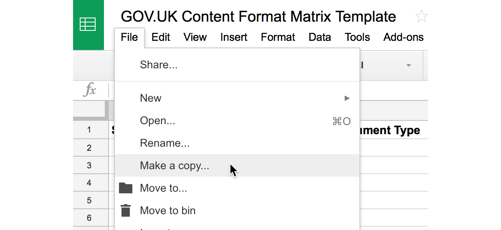

# GOV.UK Content Format Matrix

This repository contains tools and documentation for generating a GOV.UK Content Format Matrix that will look something like this:


## What is a content format matrix?

A content format matrix provides a live snapshot of the current state of all the different formats in the content store. A format is defined as the combination of: schema name, document type, rendering app and publishing app.

Additionally, it displays to what extent history is stored or displayed on the frontend and the backend.

## How to generate an up-to-date matrix?

Follow the instructions below to create your own format matrix.

### Generate CSV Dump

First you must generate a dump of all the formats by running the following command on your development laptop:

```bash
$ ./generate-matrix
```

It should take about 15-20 minutes to complete and you will find a new CSV file is created at the end.

### Importing into Google Sheets

Next you will be importing the CSV file generated above into Google Sheets. Open the [Content Format Matrix Template spreadsheet][matrix-template] and make a copy by clicking on the button shown below.



Import the CSV file into Google Sheets by clicking on the import button. Make sure you select "Append rows to current sheet" when the following import window appears.


Now you have a basic version of the matrix available.

### Adding extra data

You'll notice that your matrix is already filled out with data in the frontend status column, but nothing in the backend column. Unfortunately, that column cannot currently be determined automatically, and therefore must be filled out using developer knowledge or investigation.

When modifying the data in the frontend or backend status columns, use the following letters to get the correct colours to appear:

- **H**: Full content history is stored.
- **M**: Date metadata is representative and correct.
- **X**: Date metadata is not correct or representative.
- **?**: Unknown status.

[matrix-template]: https://docs.google.com/a/digital.cabinet-office.gov.uk/spreadsheets/d/1KHiXEVvISrmUN8ou_VuIGnQL4GPOJOa0xAu4eP0tleY/edit?usp=sharing
